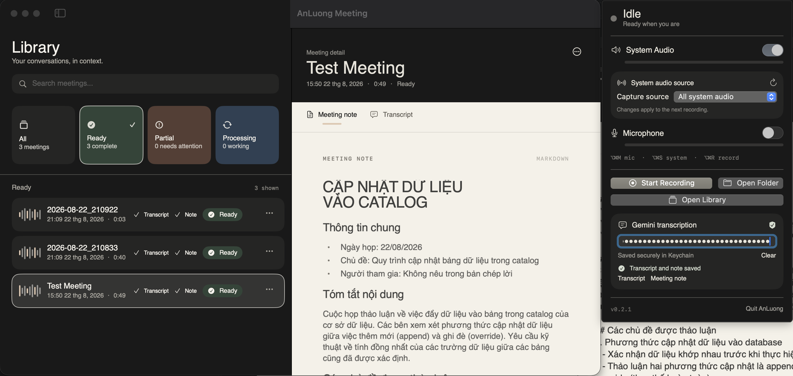

# AnLuong Meeting

AnLuong Meeting is a private meeting recorder for macOS and iPhone. Record a conversation, keep the audio locally, and use Gemini to turn it into a searchable transcript and a structured Markdown meeting note.



## Highlights

- **macOS recording:** captures microphone and system audio into a stereo `.m4a` file.
- **iPhone recording:** captures microphone audio only and can continue while the app is backgrounded or the screen is locked.
- **Gemini processing:** generates transcripts and meeting notes from recorded audio.
- **Library:** search meetings, inspect transcript and note tabs, rename records, share exports, regenerate artifacts, and permanently delete meetings with confirmation.
- **Markdown rendering:** meeting notes are displayed as formatted headings, paragraphs, lists, quotes, code blocks, and dividers instead of raw Markdown text.
- **Local-first storage:** recordings and generated artifacts stay in the app's local recordings directory. The Gemini API key is stored in the platform Keychain.
- **Progress and recovery:** processing exposes status, segment progress, retry/cancel actions, and partial-result states.

## Platform differences

| Platform | Audio source | Storage | Minimum version |
| --- | --- | --- | --- |
| macOS | Microphone + system audio | `~/Recordings` | macOS 14.2 |
| iOS | Microphone only | App container | iOS 17 |

System audio capture is intentionally unavailable on iOS because iOS does not provide the same system-audio recording model as macOS.

## Requirements

- macOS 14.2 or later for the macOS app.
- iOS 17 or later for the iOS app.
- Xcode with Swift 5.9 or later.
- A physical iPhone and an Apple development team for device builds.
- A Gemini API key for transcription and meeting-note generation. Create one at [Google AI Studio](https://aistudio.google.com/apikey).

## Build and install

Clone the repository and open the project directory:

```bash
git clone https://github.com/luongnguyenminhan/AnLuongMeeting.git
cd AnLuongMeeting
```

### macOS app

Build the native macOS target from the workspace:

```bash
xcodebuild \
  -workspace AnLuongMeeting.xcworkspace \
  -scheme AnLuongMeeting-macOS \
  -destination 'platform=macOS' \
  CODE_SIGNING_ALLOWED=NO \
  build
```

To build the packaged menu-bar app:

```bash
./make-app.sh
open "AnLuong Meeting.app"
```

To install it for the current user, move `AnLuong Meeting.app` into `/Applications` using Finder or:

```bash
mv "AnLuong Meeting.app" "/Applications/AnLuong Meeting.app"
open "/Applications/AnLuong Meeting.app"
```

The first recording requires these permissions:

1. **Microphone**
2. **Screen Recording** for macOS system-audio capture

Grant them in **System Settings → Privacy & Security**, then fully quit and relaunch AnLuong Meeting. No video is saved; Screen Recording permission is used to access system audio through ScreenCaptureKit.

### iOS app

Open the iOS project:

```bash
open iOS/AnLuongMeetingiOS/AnLuongMeetingiOS.xcodeproj
```

In Xcode:

1. Select the `AnLuongMeetingiOS` scheme.
2. Select an iOS 17+ simulator or a connected iPhone.
3. For a physical device, select your Apple development team under **Signing & Capabilities**.
4. Build and run.
5. Allow microphone access when prompted.

The equivalent simulator build is:

```bash
xcodebuild \
  -project iOS/AnLuongMeetingiOS/AnLuongMeetingiOS.xcodeproj \
  -scheme AnLuongMeetingiOS \
  -destination 'generic/platform=iOS Simulator' \
  CODE_SIGNING_ALLOWED=NO \
  build
```

For a TestFlight archive, choose **Any iOS Device (arm64)** in Xcode, then use **Product → Archive → Distribute App → App Store Connect → Upload**. The bundle identifier is `com.anluong.meeting.ios`.

## First-time setup

### macOS

1. Launch AnLuong Meeting from the menu bar.
2. Allow Microphone and Screen Recording access.
3. Open the settings area and save a Gemini API key.
4. Choose the system-audio source if you want to capture one application or window instead of all eligible system audio.

### iOS

1. Open **Settings** inside the app.
2. Enter your Gemini API key in the **Gemini** section.
3. Tap **Save API key**. The key is stored in Keychain.
4. Tap **Test API key** to verify authentication without uploading a recording.
5. Allow notifications if you want completion and failure alerts.

## How to use

1. Open **Record** and start a meeting recording.
2. On macOS, select microphone and system-audio sources before recording. On iOS, only the microphone is used.
3. Stop the recording when the meeting ends. The audio is saved locally.
4. Wait for Gemini processing. Status, progress, partial results, errors, and retry actions are shown in the Library.
5. Open a meeting to switch between **Meeting note** and **Transcript**.
6. Use the meeting action menu to rename, regenerate the transcript, regenerate the note, share available files, or permanently delete the meeting.

On iOS, recording can continue while the app is in the background or the screen is locked. Force-quitting the app stops an active recording, but audio already flushed to the app container remains recoverable.

## macOS system-audio sources

Open the menu-bar popover and use **System audio source** to refresh and select one of:

- **All system audio** from the selected display.
- **Application audio** for one running application.
- **Window audio** for one visible window exposed by ScreenCaptureKit.

The selected application or window must still be available when recording starts. If a saved source is unavailable, the app shows that state instead of silently falling back to all system audio. A window selection may include audio produced by other windows in the same application; choose application selection when process-level isolation is preferred.

## Where data is stored

The macOS app stores recordings and generated artifacts in:

```text
~/Recordings
```

For each meeting, the Library can index the recording, transcript, and meeting note together. The iOS app uses its private app container. Generated files are local and can be shared from a meeting's action menu.

The API key is never committed to the repository. It is stored in the macOS Keychain or iOS Keychain and can be replaced from Settings.

## Local development settings

Optional macOS audio tuning values can be set with `defaults`:

```bash
defaults write com.anluong.meeting MicGainDb -float 6
defaults write com.anluong.meeting DisableAEC -bool true
```

Delete either preference to return to the app default:

```bash
defaults delete com.anluong.meeting MicGainDb
defaults delete com.anluong.meeting DisableAEC
```

## Test

Run the macOS executable tests:

```bash
swift test
```

Run the shared core package tests:

```bash
swift test --package-path Packages/AnLuongMeetingCore
```

The iOS target also includes behavior tests in `iOS/AnLuongMeetingiOS/AnLuongMeetingiOSTests`.

## Project structure

```text
Sources/AnLuongMeeting/                         macOS menu-bar app
iOS/AnLuongMeetingiOS/                          iOS app and Xcode project
Packages/AnLuongMeetingCore/                    Shared models, storage, Markdown, Gemini pipeline
Tests/AnLuongMeetingTests/                      macOS tests
iOS/AnLuongMeetingiOS/AnLuongMeetingiOSTests/   iOS behavior tests
docs/images/                                    README screenshots
```

## Privacy and security

AnLuong Meeting is designed around local storage and explicit user actions. It does not include a bundled Gemini credential. Audio is sent to Gemini only when processing is started with a user-supplied API key. Review the Google Gemini API terms and your organization's recording-consent requirements before recording a meeting.

## License

See [LICENSE](LICENSE).
